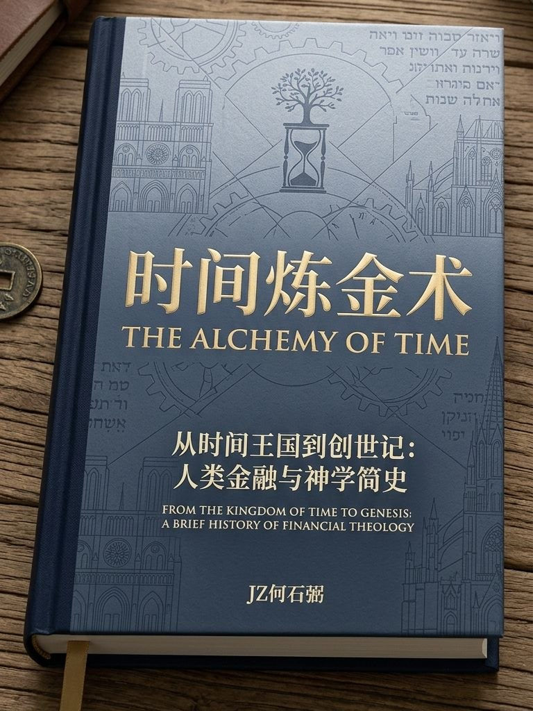

# THE-ALCHEMY-OF-TIME
**时间炼金术  
THE ALCHEMY OF TIME**

FROM THE KINGDOM OF TIME TO GENESIS  
A BRIEF HISTORY OF FINANCIAL THEOLOGY  
从时间王国到创世纪  
人类金融神学简史

[01 时间王国・第一章・互联网](#ch01)

[02 时间王国・第二章・区块链](#ch02)

[03 时间王国・第三章・The Kingdom of TIME](#ch03)

[04 时间王国・第四章・Gloria](#ch04)

[05 TIME 解决了人类哪些本质问题之诞生历史必然](#ch05)

[06 CD 的梦想宣言 Manifesto](#ch06)

[07 圣经神学](#ch07)

[08 聖約神學](#ch08)

未完待续 To be continued

:[时间王国・第一章・互联网](./01时间王国・第一章・互联网.md)

:[时间王国・第二章・区块链](./02时间王国・第二章・区块链.md)

:[时间王国・第三章・The Kingdom of TIME](./03时间王国・第三章・The Kingdom of TIME.md)

:[时间王国・第四章・Gloria](./04时间王国・第四章・Gloria.md)

:[TIME 解决了人类哪些本质问题之诞生历史必然](./05TIME解决了人类哪些本质问题之诞生历史必然.md)

:[CD 的梦想宣言 Manifesto](./06CD梦想宣言Manifesto.md)

:[圣经神学](./07圣经神学.md)

:[聖約神學](./08聖約神學.md)